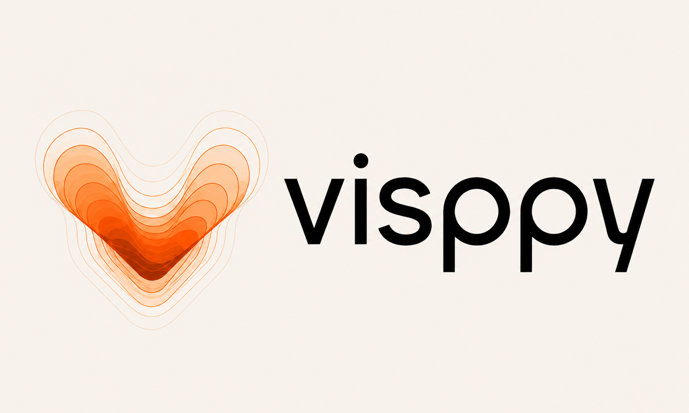
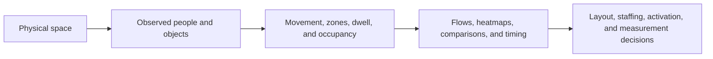

# Visppy — Intelligence for Physical Spaces

> Turn movement in physical spaces into clear decisions about layout, staffing, engagement, and operations.

**Live website:** [visppy.com](https://visppy.com)

  

<strong>Supporters &amp; Commercial Partners</strong>

Supporters, programs, and commercial partners associated with the project.

<table align="center">
  <tr>
    <td align="center"> Centelha SE</td>
    <td align="center"> Semente</td>
    <td align="center"> Sebrae Startups</td>
  </tr>
  <tr>
    <td align="center" colspan="2"> Sebrae NEON 2024</td>
    <td align="center"> M360</td>
  </tr>
</table>

## What Visppy does

Visppy helps teams understand what is happening inside stores, activations, stands, lecture rooms, and other physical environments.

It turns observed movement into answers such as:

- Where does attention or congestion accumulate?
- Which paths connect areas of the space?
- Where do people stay, pass through, or disengage?
- How should layout, staffing, signage, or measurement change?

## From observation to action

The public portfolio shows the decision layer. It intentionally does not publish private implementation rules, customer-specific calibration, thresholds, credentials, or commercial logic.

## What a client receives

| Deliverable | Client question it supports |
| --- | --- |
| Zone map and heatmap | Where is visible demand concentrated? |
| Flow and journey view | How do people move between areas? |
| Occupancy and dwell view | Which areas retain attention or create pressure? |
| Time-based analysis | When should the team act? |
| Impact-versus-effort view | Which improvement should be tested first? |
| Measurement roadmap | What signal is still needed to connect behavior to business results? |

## Case studies

### Mandala — make circulation commercially useful

The analysis identifies a circulation-heavy side of the stand, a transition toward the central screen, and a more consultative area. The recommended move is to test a clearer call to action and staffing at the transition without blocking the corridor.

**Client takeaway:** distinguish passage from qualified attention before changing the activation.

### Loja — separate traffic from retention

The store analysis uses the real spatial layout instead of forcing a generic three-zone story. It separates outside flow, gateways, retention areas, and fixed structures so that entry, permanence, and operational friction can be discussed separately.

**Client takeaway:** measure the entrance and qualified permanence before claiming conversion.

### Palestra — interpret the room before the audience

The lecture-room analysis treats a mostly stationary audience as expected behavior. It focuses on distribution, circulation, camera framing, and a limited short-horizon forecast rather than inferring attention or participation from stillness.

**Client takeaway:** use room-specific signals and explicit participation events for events and presentations.

## Visual evidence

### Spatial zones and concentration

Zones make the conversation concrete: a hotspot can be a meaningful area, a corridor, furniture, or a waiting point. The visual must always be read with the layout.

The regional view supports consistent comparisons between left, central, and right areas.

### Journeys and movement

Movement between regions helps teams compare paths and identify where a journey becomes concentrated.

Internal flows show how a doorway, corridor, or back area can connect the wider journey.

### Prioritization and measurement quality

The matrix translates observations into a practical order of experiments.

Measurement quality varies by area. This is why comparisons should be made with the camera, distance, occlusion, and geometry in mind.

Volume and quality are different signals: the busiest area is not automatically the most valuable one.

## Measurement boundaries

Visppy reports visible behavior and spatial patterns. Video alone does not prove unique visitors, identity, gaze, emotion, demographics, attention, conversion, sales, or return on investment.

Reliable business conclusions require the right supporting signals, such as validated entry lines, check-in, QR events, customer records, point-of-sale events, human review, or approved operational context.

## Privacy and safe publication

The public portfolio excludes customer footage, identifiable people, private endpoints, credentials, raw observation files, model weights, and proprietary rules. See the [privacy and safe publication policy](docs/privacy.md).

## Further reading

- [Product case study](docs/product-case-study.md) — the problem, product response, and decision stories.
- [Spatial analytics](docs/spatial-analytics.md) — zones, heatmaps, flows, dwell, and interpretation limits.
- [Video analytics](docs/video-analytics.md) — timing, peaks, phases, and forecasting boundaries.
- [High-level architecture](docs/architecture.md) — the public flow from space to decision.

For the product itself, visit [visppy.com](https://visppy.com).
