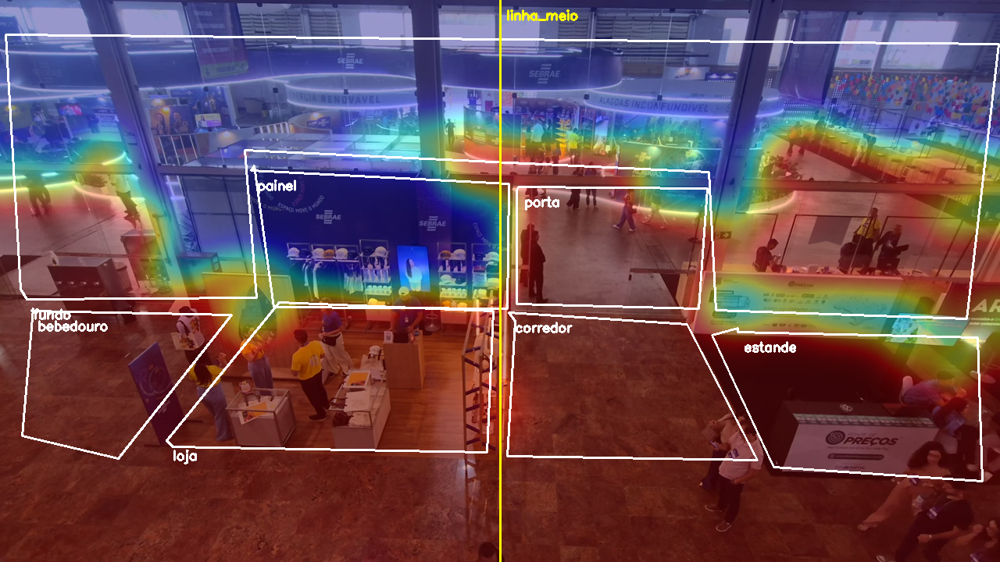
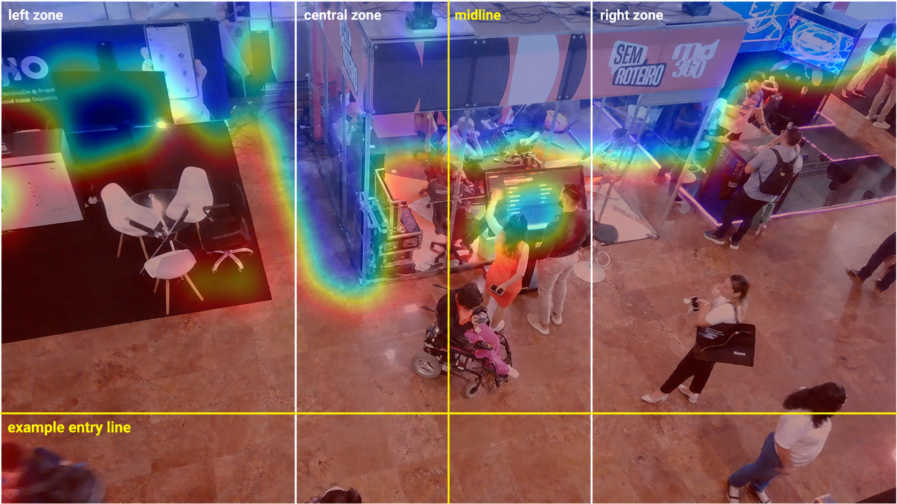
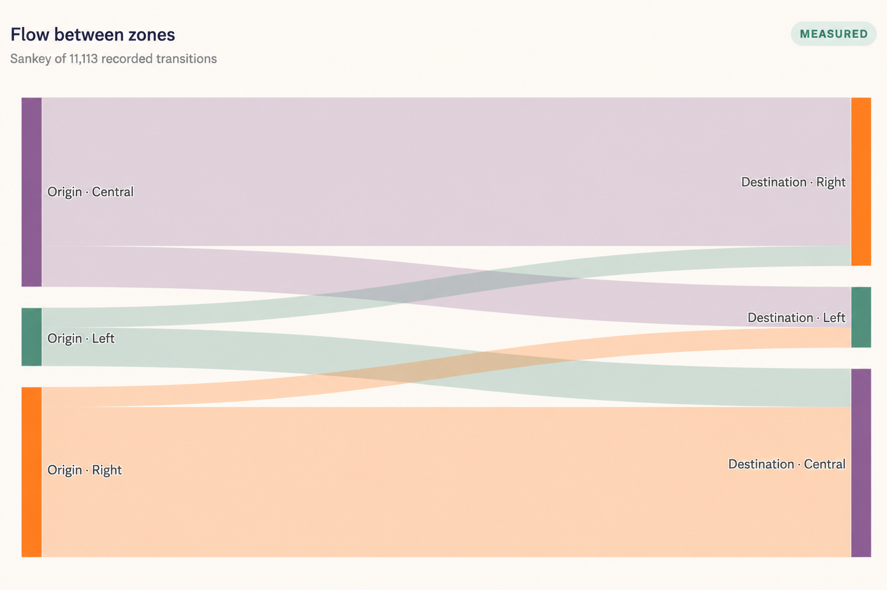
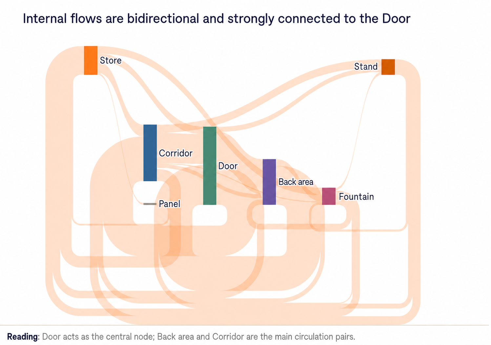
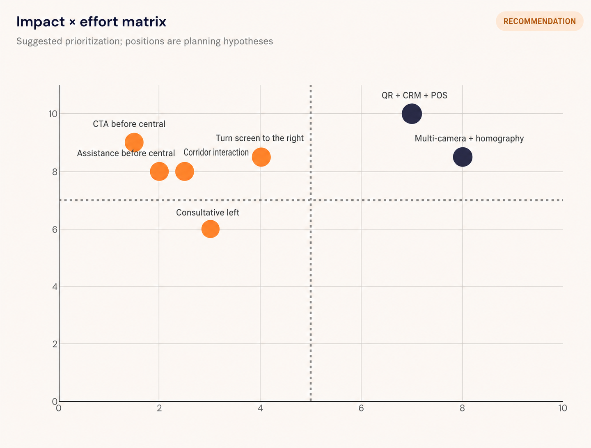
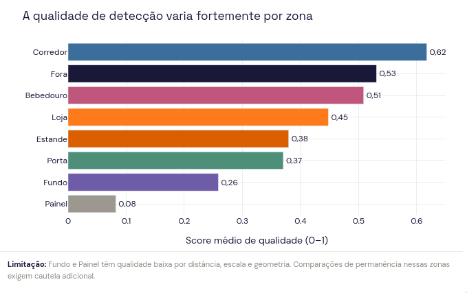
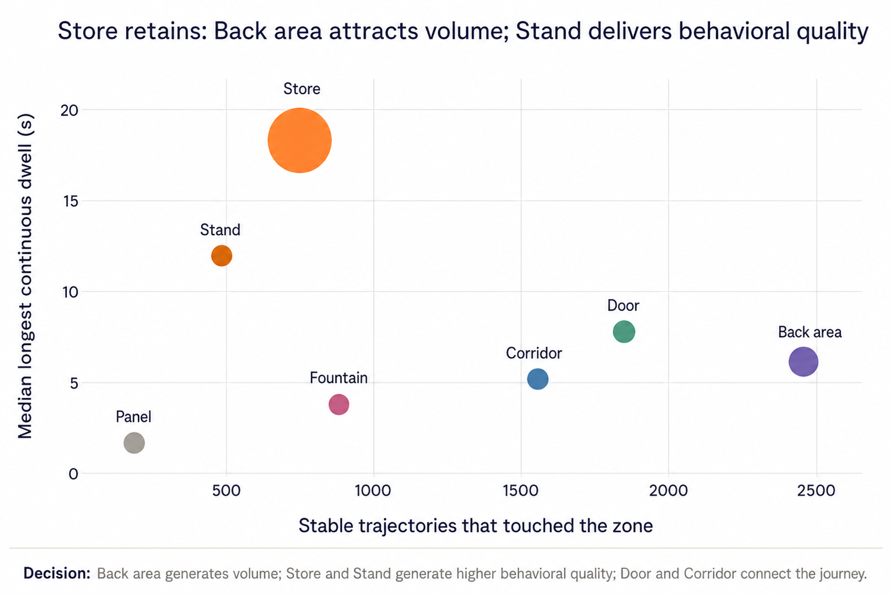

# Visppy — Computer Vision & Spatial Intelligence

> A portfolio case study about turning video from physical spaces into operational, spatial, and behavioral signals.

[](https://visppy.com)

**Live website:** [visppy.com](https://visppy.com)

## Executive summary

Visppy helps teams understand how people and objects occupy, move through, and interact with physical spaces. This repository presents the engineering story behind that product through computer-vision evidence, spatial analytics, and decision-oriented dashboards.

```text
Video and camera context
            ↓
Computer-vision observations
            ↓
Tracking, relinking, and spatial zones
            ↓
Occupancy, heatmaps, flows, and temporal signals
            ↓
Operational recommendations
```

The upstream detector and tracker implementation is not included in this public portfolio checkout. Claims are therefore separated into confirmed evidence, visual evidence, and architectural inference.

## What is included

| Capability | What this portfolio shows | Evidence status |
| --- | --- | --- |
| Object detection | Object classes, confidence scores, area ratios, and interaction proxies | Confirmed by supplied data |
| Tracking and relinking | Stable trajectories, fragmentation, dwell time, and re-entry caveats | Confirmed by report artifacts |
| Spatial analytics | Polygons, heatmaps, occupancy, transitions, and zone comparisons | Confirmed by supplied visuals and reports |
| Video analytics | Sampling, temporal windows, hotspots, and short-horizon forecasting | Confirmed by report artifacts |
| Dashboard delivery | React/Vite shell, embedded reports, and Plotly visualizations | Confirmed by source code |
| Public product presence | Link to the live Visppy website | Confirmed by external link |

## Evidence snapshot

The included CSV is an aggregated object-summary snapshot, not raw video and not a visitor database:

| Measure | Value |
| --- | ---: |
| Class/zone rows | 63 |
| Aggregated detections | 114,662 |
| Potential interaction observations | 33,321 |
| Highest-volume class | Chair — 78,283 detections |
| Second-highest class | TV/screen — 31,229 detections |
| Highest-volume zone | Left zone — 75,814 detections |

These values describe model observations. They should not be interpreted as unique people, unique visits, or causal measures of conversion.

Download the [DuckDB object summary CSV](assets/data/duckdb-object-summary.csv).

## Visual evidence gallery

The gallery uses English-localized derivatives generated from the supplied captures. Chart values, point positions, bar order, and flow structure were treated as invariants during localization; real-world signage visible inside photographs remains part of the original scene. Every caption, interpretation, and technical note in this README is in English.

### Zone overlays and regional heatmaps



The polygon overlay makes the spatial contract explicit: each observation is interpreted relative to named regions such as store, panel, corridor, doorway, stand, and fountain. The heatmap adds concentration, but a hotspot still needs contextual interpretation because it may represent circulation, furniture, or a meaningful interaction.



The regional view separates left, central, and right areas and highlights the midline used for comparison. This supports consistent zone-level reporting while keeping the limitations of image-space measurement visible.

### Flows and movement structure



The flow diagram summarizes transitions between left, central, and right regions. It is useful for comparing directional movement, but it should not be presented as an entrance/exit count without a validated line-crossing definition.



The internal-flow view shows the doorway as a central connector, with the back area and corridor forming important circulation pairs. This is a route-level product insight: layout and placement influence how people move between operational areas.

### Decisions and model quality



The matrix prioritizes improvements by expected impact and implementation effort. QR + CRM + POS integration and multi-camera geometry are high-impact investments; clearer calls to action near the central area are comparatively easier experiments.



Detection quality varies by zone: the corridor scores highest at 0.62, while the panel is lowest at 0.08. Distance, scale, occlusion, and geometry make cross-zone comparisons unsafe unless the measurement conditions are normalized.



The trajectory-versus-dwell view separates volume from behavioral quality. The store attracts the longest continuous dwell, while the back area records the largest number of stable trajectories. These are different signals and should not be collapsed into one “best zone” score.

## Case studies at a glance

### Mandala — commercial intelligence in a physical stand

The report frames the right side as circulation-heavy, the center as a transition toward the screen, and the left side as more consultative. It explicitly separates measured signals from inference and unavailable signals.

Selected report values: 40,362 processed frames, 23 simultaneous visible people at peak, 10.9 visible people per frame on average, 7.50 analyzed frames per second, and 1,828 estimated stable IDs from 6,123 raw IDs. These are trajectory estimates, not unique visitors.

### Loja — spatial analytics across eight effective zones

The store report adapts the narrative to the actual dataset instead of forcing a generic three-zone model. It distinguishes external flow, gateways, retention areas, and physical structures across eight effective zones.

Selected report values: 76,242 frames, approximately 150 minutes of coverage, 20,547 event-triggered segmentation masks across 897 frames, and a zone table covering occupancy, peaks, trajectories, dwell time, and heuristic staff presence.

### Palestra — occupancy and circulation in a lecture room

The lecture report treats a mostly stationary audience as expected behavior rather than noise. It uses spatial distribution, circulation, camera framing, and a limited next-minute occupancy forecast. Participation and conversion require explicit signals such as QR scans, check-in, or CRM events.

Selected report values: 2h03m21s analyzed, 12.7 visible people per frame on average, 23 at peak, 40.4% of observed occupancy on the left, and a one-test forecast comparison with mean error 1.04 versus 1.41 for a simple baseline.

## Engineering story

1. [Architecture](docs/architecture.md) — evidence-based system map and scope boundaries.
2. [Computer-vision pipeline](docs/computer-vision-pipeline.md) — detection, tracking, and safe claims.
3. [Spatial analytics](docs/spatial-analytics.md) — zones, heatmaps, occupancy, transitions, and dwell time.
4. [Video analytics](docs/video-analytics.md) — sampling, temporal windows, hotspots, and forecasting.
5. [Data pipeline](docs/data-pipeline.md) — Parquet-oriented evidence model and analytical layers.
6. [Infrastructure](docs/infrastructure.md) — the verified React/Vite/Firebase delivery layer.
7. [Edge AI](docs/edge-ai.md) — what would need validation for edge or real-time deployment.
8. [Product case study](docs/product-case-study.md) — problem, product decisions, and impact.
9. [Technical decisions](docs/technical-decisions.md) — trade-offs and limitations.
10. [Privacy and publication rules](docs/privacy.md) — what is intentionally excluded.
11. [Evidence ledger](docs/evidence.md) — provenance and confidence labels.

## Visual system

The portfolio preserves the Visppy visual language: warm ivory surfaces, mineral indigo, signal orange, deep amber, mineral green, DM Sans for body text, and Space Grotesk for labels and interface accents. See [the visual system notes](docs/technical-decisions.md#visual-system).

- [Visppy logo](assets/brand/visppy-logo.png)
- [Pipeline diagram](assets/architecture/visppy-pipeline.mmd)
- [Executive dashboard](assets/screenshots/dashboard-executive.png)
- [Visual-slot index](assets/placeholders/README.md)

The [safe public example](examples/safe-public-examples/observation-contract.json) is synthetic. It demonstrates the shape of an observation record without exposing source footage, model weights, credentials, or proprietary inference code.

## Scope and disclosure

This is a curated portfolio derivative, not a mirror of the private application and not a runnable copy of its source repository. It does not include credentials, Firebase configuration, customer footage, source Parquet files, full HTML reports, embedded Plotly bundles, private endpoints, or proprietary upstream inference code.

Claims are labeled as:

- **Confirmed by source code** — visible in the React/Vite or hosting files.
- **Confirmed by report artifact** — stated or rendered by supplied reports.
- **Confirmed by visual asset** — visible in a supplied image or logo.
- **Inferred** — a reasonable architecture interpretation, not a proven implementation detail.
- **Portfolio recommendation** — a proposed next step, not a shipped capability.
- **Not confirmed** — no supporting evidence was found in the inspected checkout.

The source application contains client-side Firebase configuration and a client-side password hash. Neither is reproduced here.

## Status

Portfolio case study enriched with the supplied visual evidence, translated English narrative, and the CSV data snapshot. The implementation remains intentionally scoped to public documentation and safe derivative assets.
