<p align="center">
  <picture>
    <source media="(prefers-color-scheme: dark)" srcset="assets/brand/header-dark.svg">
    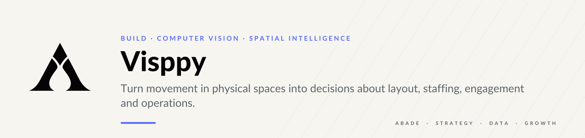
  </picture>
</p>

<p align="center">
  
  
  <a href="https://visppy.com"></a>
  
</p>

**Video of a physical space becomes a short list of layout and staffing experiments.** Visppy turns
observed movement into zones, flows, dwell and timing, and it states plainly what video alone
cannot prove.

<p align="center">
  <picture>
    <source media="(prefers-color-scheme: dark)" srcset="assets/brand/kpis-dark.svg">
    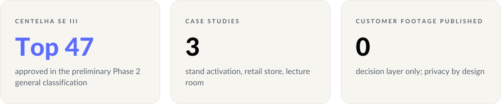
  </picture>
</p>

<p align="center">
  <picture>
    <source media="(prefers-color-scheme: dark)" srcset="assets/brand/arc-dark.svg">
    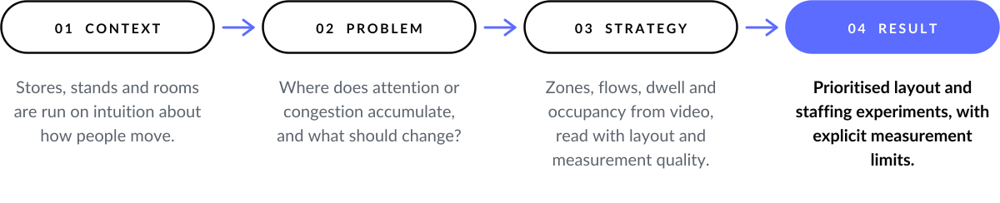
  </picture>
</p>

---

## 01 — Context

<p align="center">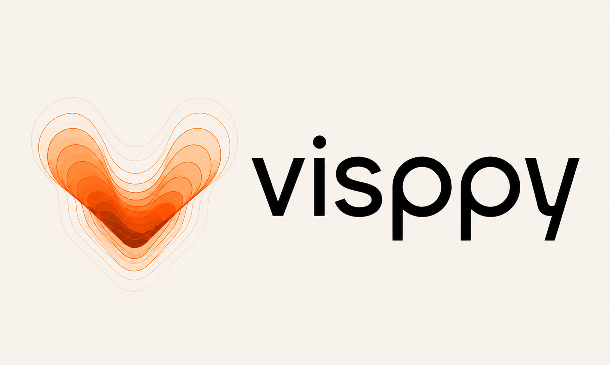</p>

Stores, activations, stands and lecture rooms are run on intuition about how people move. Teams see
crowds, but not where attention accumulates, which paths connect areas, or where people disengage.

**Recognition.** Evaluated under its former name, *Imagyx: monitoramento visual de espaços coletivos
por IA*, with Ariel Lima Abade Bandeira as proponent, the project appears in the official Centelha
Sergipe III preliminary Phase 2 result among the **100 projects selected for the next stage** and the
**47 approved in the general classification**
([announcement](https://fapitec.se.gov.br/saiu-o-resultado-preliminar-da-fase-02-do-programa-centelha/) ·
[classification PDF](https://fapitec.se.gov.br/wp-content/uploads/2026/04/Resultado-Preliminar-da-FASE-2-CENTELHA-SE.pdf)).

<details>
<summary><strong>Supporters and commercial partners</strong></summary>

<table align="center">
  <tr>
    <td align="center"><br><sub>Centelha SE</sub></td>
    <td align="center">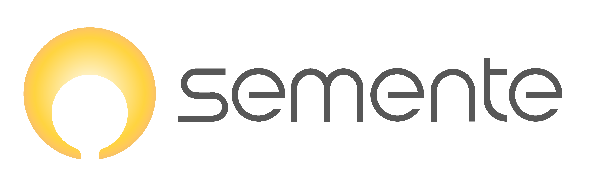<br><sub>Semente</sub></td>
    <td align="center">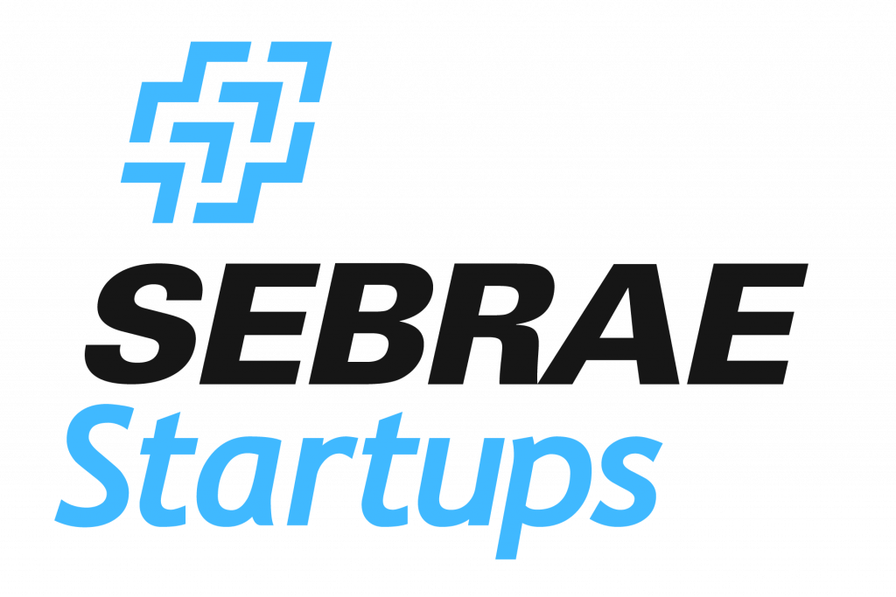<br><sub>Sebrae Startups</sub></td>
  </tr>
  <tr>
    <td align="center" colspan="2">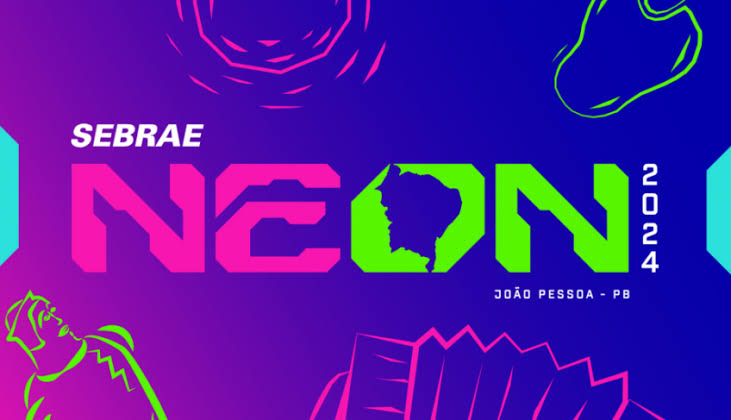<br><sub>Sebrae NEON 2024</sub></td>
    <td align="center">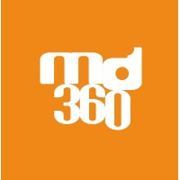<br><sub>M360</sub></td>
  </tr>
</table>

</details>

---

## 02 — Problem

- Where does attention or congestion accumulate?
- Which paths connect areas of the space?
- Where do people stay, pass through, or disengage?
- How should layout, staffing, signage or measurement change?

---

## 03 — Strategy

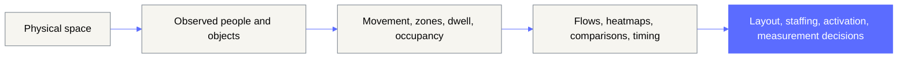
```mermaid
%%{init: {'theme':'base','themeVariables':{'primaryColor':'#F6F5F0','primaryTextColor':'#050505','primaryBorderColor':'#7E8791','lineColor':'#5B6CFF','fontFamily':'Lato, Helvetica, Arial, sans-serif'}}}%%
flowchart LR
    SPACE[Physical space] --> OBS[Observed people and objects]
    OBS --> MOVEMENT[Movement, zones, dwell, occupancy]
    MOVEMENT --> INSIGHT[Flows, heatmaps, comparisons, timing]
    INSIGHT --> ACTION[Layout, staffing, activation, measurement decisions]
    style ACTION fill:#5B6CFF,stroke:#5B6CFF,color:#FFFFFF
```

| Deliverable | Client question it supports |
| --- | --- |
| Zone map and heatmap | Where is visible demand concentrated? |
| Flow and journey view | How do people move between areas? |
| Occupancy and dwell view | Which areas retain attention or create pressure? |
| Time-based analysis | When should the team act? |
| Impact-versus-effort view | Which improvement should be tested first? |
| Measurement roadmap | What signal is still needed to connect behaviour to business results? |

Every hotspot is read together with the layout: it can be a meaningful area, a corridor, furniture or a
waiting point. Measurement quality is read per zone, because camera distance, occlusion and geometry
vary.

| | |
| --- | --- |
| 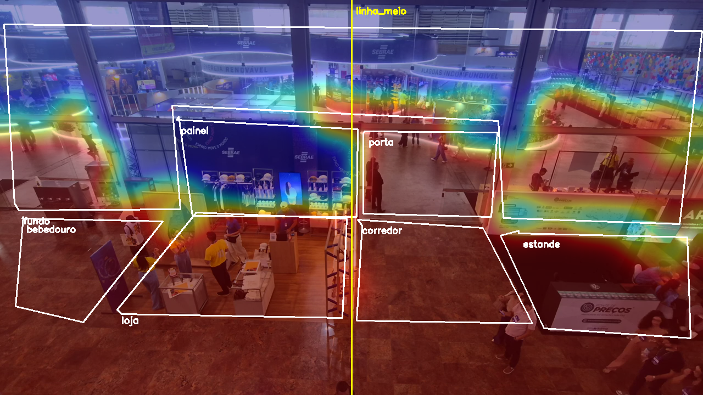 | 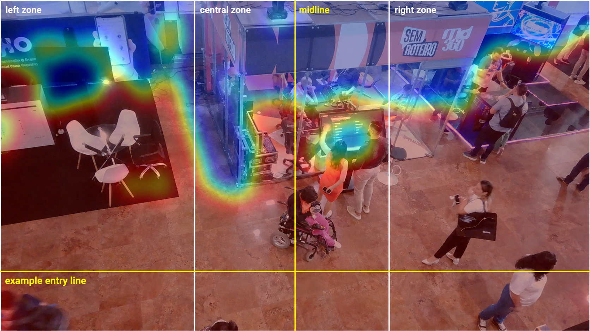 |
| 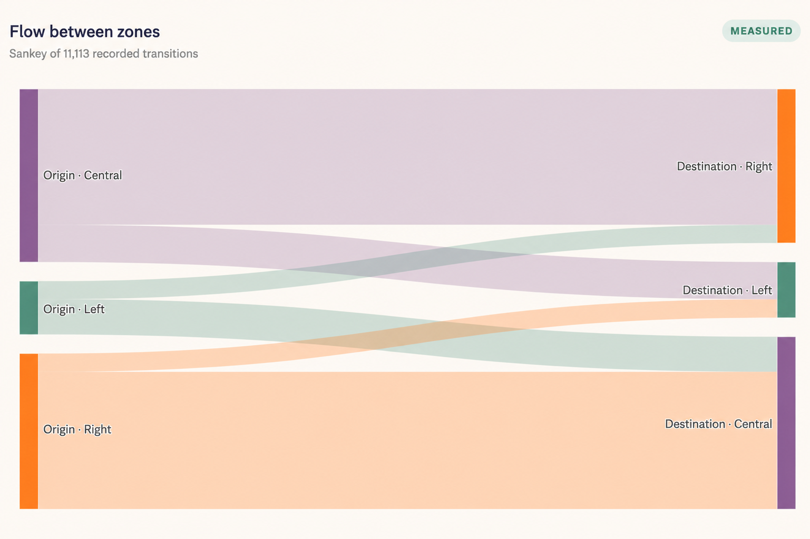 | 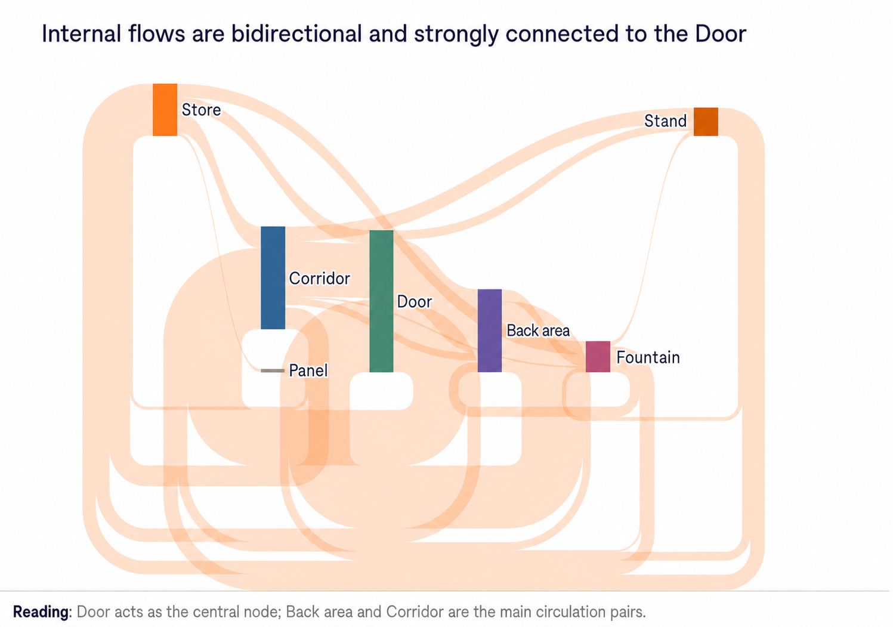 |
| 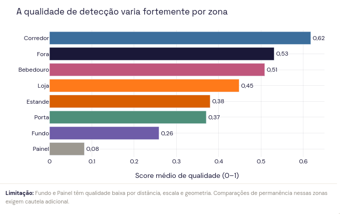 | 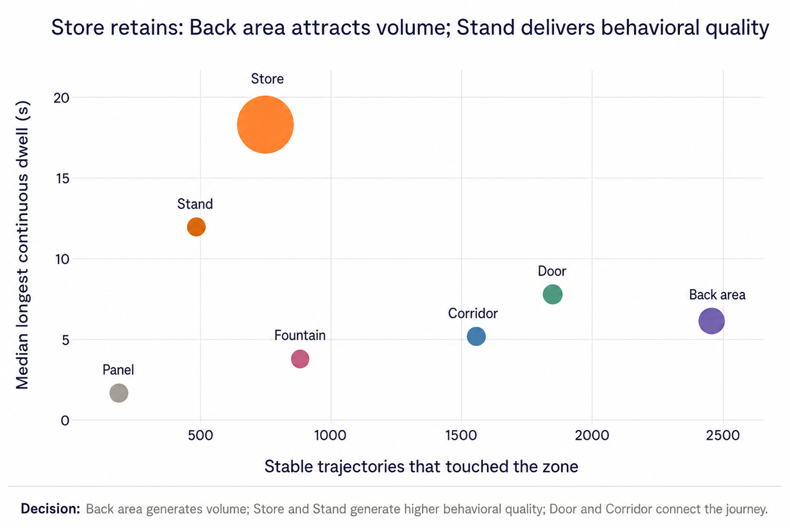 |

---

## 04 — Result

Three case studies, each ending in a decision:

| Case | Finding | Decision |
| --- | --- | --- |
| **Mandala** (stand) | A circulation-heavy side, a transition toward the central screen, and a consultative area. | Test a clearer call to action and staffing at the transition, without blocking the corridor. Separate passage from qualified attention. |
| **Loja** (store) | Outside flow, gateways, retention areas and fixed structures, mapped on the real layout instead of a generic three-zone story. | Measure the entrance and qualified permanence before claiming conversion. |
| **Palestra** (lecture room) | A mostly stationary audience is expected behaviour, not disengagement. | Use room-specific signals and explicit participation events, not stillness, to infer attention. |

<p align="center">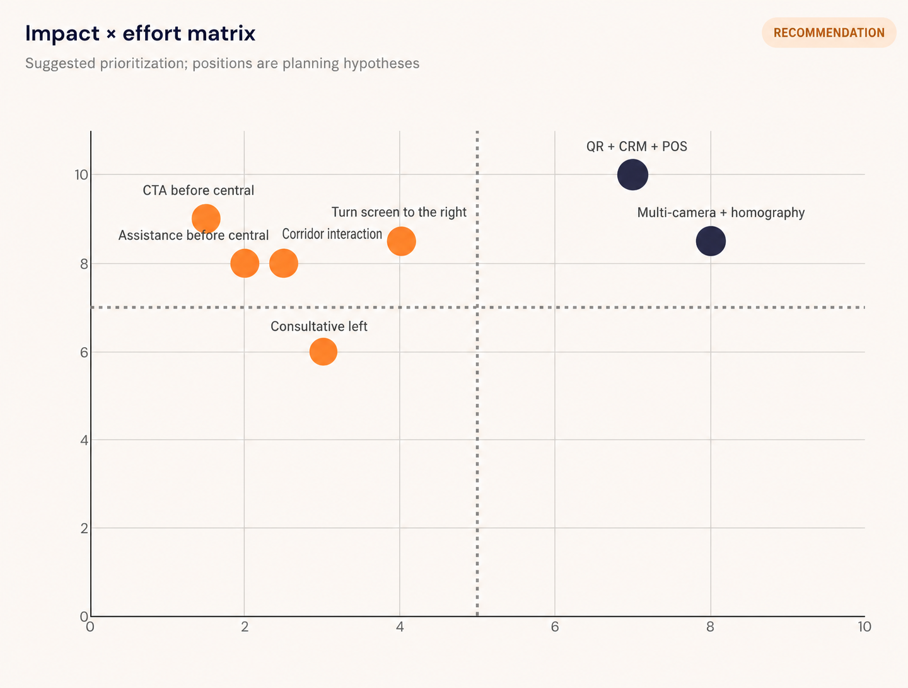</p>

> **Outcome.** Observations translate into an ordered list of experiments. The busiest area is not
> automatically the most valuable one.

---

## 05 — Limits and next move

Video shows visible behaviour and spatial patterns. **It does not prove** unique visitors, identity,
gaze, emotion, demographics, attention, conversion, sales or return on investment. Those need
supporting signals: validated entry lines, check-in, QR events, customer records, point-of-sale events,
human review or approved operational context.

The public portfolio excludes customer footage, identifiable people, private endpoints, credentials,
raw observation files, model weights and proprietary rules
([privacy policy](docs/privacy.md)).

**Next move:** connect zone-level dwell to point-of-sale events, so qualified attention can be tested
against revenue.

---

## Read further

This repository documents a product. There is no code to run. Visit [visppy.com](https://visppy.com)
for the product itself.

## Repository map

```
docs/product-case-study.md   the problem, product response and decision stories
docs/spatial-analytics.md    zones, heatmaps, flows, dwell and interpretation limits
docs/video-analytics.md      timing, peaks, phases and forecasting boundaries
docs/architecture.md         the public flow from space to decision
docs/privacy.md              privacy and safe publication policy
assets/case-study/           sanitised visual evidence
assets/partners/             supporter and partner logos
```

---

<p align="center">
  <picture>
    <source media="(prefers-color-scheme: dark)" srcset="assets/brand/track-dark.svg">
    
  </picture>
</p>

<p align="center">
  <a href="https://github.com/arielabade">Portfolio</a> &nbsp;·&nbsp;
  <a href="https://visppy.com">visppy.com</a>
</p>
