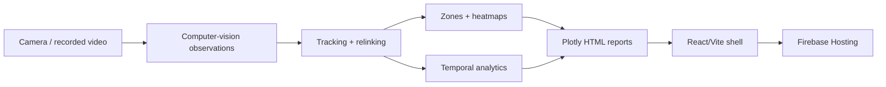

# Architecture

## Executive view

The portfolio architecture has two distinct layers:

1. An analytical layer represented by the report artifacts: observations, tracks, spatial polygons, temporal aggregations and recommendations.
2. A verified delivery layer implemented in the checkout: a React/Vite shell that loads raw HTML reports into an iframe and is configured for Firebase Hosting.

The editable Mermaid source is available at [`assets/architecture/visppy-pipeline.mmd`](../assets/architecture/visppy-pipeline.mmd).

## Evidence map

| Layer | What is directly visible | Confidence |
| --- | --- | --- |
| Delivery shell | React components, dashboard registry, login/session state, iframe rendering | Confirmed by source code |
| Build and hosting | Vite build, Firebase Hosting target `dist`, SPA rewrite to `index.html` | Confirmed by source/configuration |
| Report rendering | Plotly 3.3.1 embedded inside the HTML reports | Confirmed by report artifacts |
| Detection layer | YOLO confidence, object classes, people observations and frame-level language | Confirmed by report artifacts |
| Tracking layer | Raw/stable ID counts, relinking, dwell and trajectory language | Confirmed by report artifacts |
| Spatial layer | Heatmaps, effective polygons, zone occupancy and transition matrices | Confirmed by report artifacts |
| Upstream compute | Exact model runtime, GPU, edge device, queue, API or orchestration | Not present in checkout |

## Delivery shell

The React app keeps the reports as raw HTML imports and selects among three dashboards: Mandala, Loja and Palestra. Each report runs inside an iframe, which isolates its CSS and native script behavior from the shell. The build is a static Vite output and the Firebase configuration supplies a catch-all rewrite for client-side delivery.

This is a presentation architecture. It should not be read as proof that inference occurs in the browser or on Firebase Hosting.

## Upstream analytical inference boundary

The reports refer to Parquet-derived metrics, YOLO detections, tracking/relinking, segmentation triggers and forecasting. The source checkout does not contain the Python jobs, model weights, stream consumers, APIs or infrastructure definitions that produced those artifacts. The arrows from video to observations and from observations to tracking in the diagram are therefore a portfolio-level reconstruction of the analytical story, not a claim about the exact production implementation.

## Security boundary

The source app contains a client-side login flow and a Firebase web configuration. Those details are intentionally not copied into this public derivative. A client-side password hash is not a substitute for production authentication; the portfolio describes the UI shell without publishing credentials or reproducing the access mechanism.