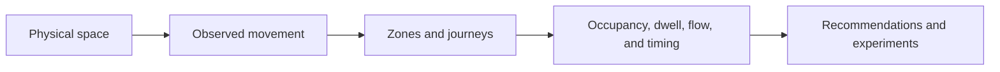
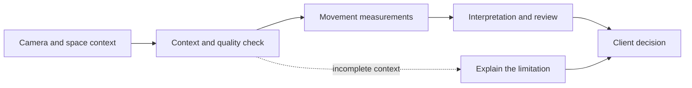

# High-level product architecture

Visppy follows a simple client-facing journey: observe a physical space, organize what happened by region and time, and turn the pattern into an operational decision.

## Reliability by design

The product is most useful when every insight carries its context and limits.

The public portfolio does not disclose private implementation rules, calibration, thresholds, credentials, customer-specific logic, or infrastructure details. It shows what the client can understand and act on.
