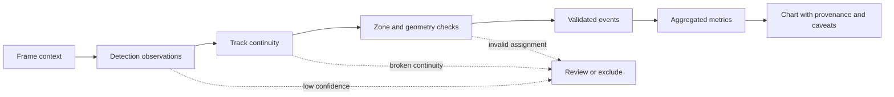

# Computer-vision pipeline

## What the evidence supports

The three reports consistently describe a computer-vision measurement layer over recorded video. The safe portfolio claim is not “a complete YOLO platform is included here”; it is:

> Visppy reports expose object and person observations that can be aggregated into spatial and temporal signals for physical-space decisions.

The reports mention YOLO confidence, detected people, plausible object classes, positions in the image, segmentation events and object-detection inventories. The detector implementation itself is not present in the current checkout.

## Conceptual stages

```text
Frame sampling
  → person/object observations
  → confidence and spatial position
  → track association and relinking
  → zone assignment
  → occupancy, dwell, heatmap and flow metrics
```

Only the last stages are implemented visibly in the supplied report artifacts. The first stages are evidenced by the metrics and labels those reports render.

## Reliability checkpoints

The pipeline becomes more trustworthy when each transformation has a visible contract:



Useful checks include frame and timestamp coverage, confidence distributions by zone, duplicate or impossible coordinates, track fragmentation, re-entry behavior, invalid polygon assignments, and missing context. These checks do not eliminate uncertainty; they make it visible before metrics become recommendations.

## Detection evidence

| Signal | Example from the reports | Correct interpretation |
| --- | --- | --- |
| Person confidence | Mandala reports an average YOLO confidence of 64.4% for person observations | A quality indicator that varies with zone and occlusion; not identity certainty |
| Object classes | TV, chair, table, laptop, bottle and other plausible classes appear in object inventories | Aggregated detections by frame; not persistent object identity |
| Position | Bounding-box and zone language appears throughout the spatial reports | Image-space location; no metric-world claim without homography |
| Segmentation | Loja reports 20,547 masks in 897 event-triggered frames | Triggered segmentation, not continuous segmentation of the full recording |

## Tracking evidence

Mandala reports 6,123 raw IDs consolidated into 1,828 stable IDs, an average of 3.35 raw IDs per stable ID, a median visible time of 11.2 seconds and a p90 fragmentation level of 7 raw IDs per stable ID. The report explicitly calls these “estimated trajectories,” not unique visitors.

That distinction is central to a responsible portfolio: tracking continuity is useful for dwell, transitions and funnel-like stages, but relinking and re-entry can inflate trajectories. The portfolio does not claim person re-identification, biometric identity or unique-visitor counting.

## Safe example boundary

The source checkout does not include a publishable detector or tracker implementation. The [safe example note](../examples/safe-public-examples/README.md) therefore describes an abstract observation contract rather than pretending to expose proprietary code or model weights.

<!-- VISUAL SLOT: Computer Vision inference example. Show one approved, anonymized frame with boxes, confidence labels and a short caption explaining that detections are observations, not identity. -->

<!-- VISUAL SLOT: Object tracking example. Show a short GIF or PNG sequence with persistent track IDs, relinking caveats and a visible time window. -->

## What is unavailable


The current evidence does not establish the exact YOLO family or checkpoint, training dataset, augmentation policy, inference runtime, tracker algorithm, re-identification embedding, GPU topology, latency, throughput or model versioning process. Those should be added only from approved engineering records.
