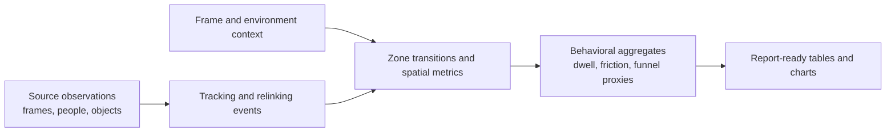

# Data pipeline

## Evidence model

The report artifacts refer to a Parquet-oriented analytical dataset. The source checkout contains no Parquet files or extraction jobs, so this page documents the evidence model without publishing data or claiming an exact schema.



The report inventory names files such as `person_observations.parquet`, `object_detections.parquet`, `raw_yolo_detections.parquet`, `zone_transitions.parquet`, `line_crossings.parquet`, `interactions.parquet`, `environment_context.parquet` and `frame_context.parquet`. These names are evidence of the report’s analytical vocabulary, not files included in this public portfolio.

## Structured event contract

Once video observations have been converted into structured events, historical analytics can be queried without retaining the original video. A conceptual event record may contain:

```text
timestamp | camera_id | track_id | x | y | zone_id | event_type
```

Example records are illustrative only:

```text
2026-08-19 10:31:01 | cam_01 | 834 | 0.32 | 0.54 | entrance | enter
2026-08-19 10:31:08 | cam_01 | 834 | 0.41 | 0.62 | hall     | enter
2026-08-19 10:31:44 | cam_01 | 834 | 0.71 | 0.48 | stand_A | enter
2026-08-19 10:32:20 | cam_01 | 834 | 0.73 | 0.49 | stand_A | exit
```

A partitioned layout could organize analytical history by date and camera:

```text
events/
├── date=2026-08-18/
│   ├── camera=01/events.parquet
│   └── camera=02/events.parquet
└── date=2026-08-19/
    └── camera=01/events.parquet
```

This layout is a public design example, not a claim that these exact paths exist in the source application.

## Flow queries

Trajectories can be transformed into origin-destination movements and queried with SQL:

```sql
SELECT
    origin_zone,
    destination_zone,
    COUNT(*) AS movements
FROM movement_events
GROUP BY origin_zone, destination_zone
ORDER BY movements DESC;
```

The resulting table can feed Sankey diagrams, origin-destination matrices, spatial journeys, bottleneck analysis, and predominant-path views. The query should be paired with a definition of valid crossings and a note about relinking uncertainty.

## Derived layers

| Layer | Example output | Safe portfolio statement |
| --- | --- | --- |
| Observation | person or object detection per frame | Model observations can be aggregated by time and location |
| Context | frame cadence, environment and event metadata | Metrics need recording context to be interpreted correctly |
| Tracking | raw IDs, stable IDs, relink events | Trajectories require continuity and uncertainty labels |
| Spatial | zone assignment, occupancy, transitions | Polygons turn image coordinates into operational regions |
| Behavioral proxy | dwell, friction, staff/fixed heuristic, funnel stages | Proxies prioritize experiments; they do not prove intent or conversion |
| Product output | chart, table, recommendation and caveat | The dashboard combines evidence with a decision narrative |

## Data quality and missing inputs

The reports explicitly note missing summary, timeline, persistence-diagnostic and consolidated-inventory files in at least one scenario. They recalculate available indicators from the supplied Parquet material and document the limitation. That is a useful engineering behavior: a report can remain useful while making the missing evidence visible.

## Public example policy


No real row-level data is copied here. A safe example should use synthetic values and preserve only the conceptual fields needed to explain the pipeline. See [safe-public-examples](../examples/safe-public-examples/README.md).
