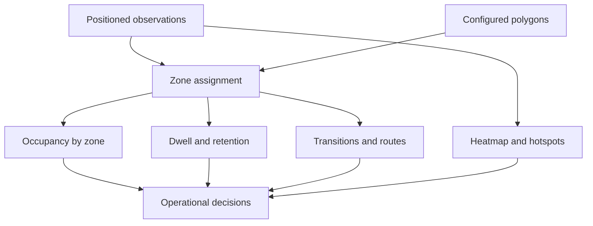
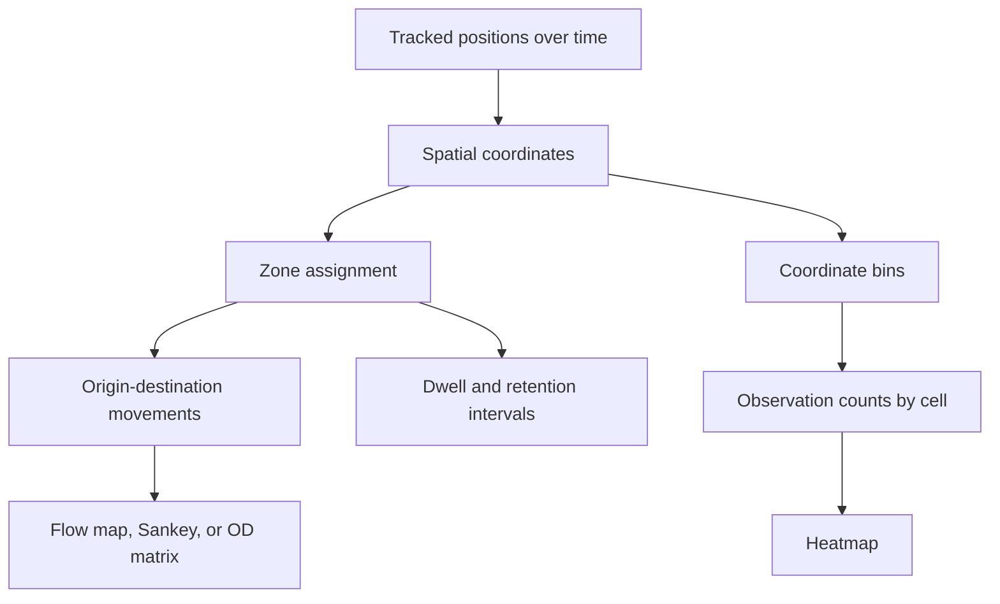

# Spatial analytics

## From pixels to place

Visppy’s distinctive analytical layer is the conversion of image-space observations into named spatial regions. The reports use heatmaps, polygon labels, zone occupancy, dwell time, trajectories and transition matrices to turn a video into a discussion about flow, retention and operational friction.



## Scenario-specific spatial models

| Scenario | Spatial model in the report | Portfolio lesson |
| --- | --- | --- |
| Mandala | Right, central and left regions around a branded stand | A hot zone can be circulation rather than commercial efficiency |
| Loja | Eight effective zones: Loja, Painel, Corredor, Porta, Fundo, Bebedouro, Estande and Fora | Use the real polygon model instead of forcing a generic three-zone story |
| Palestra | Three visible room regions: left, center and right | Audience density and camera occlusion must be interpreted together |

## Measures and caveats

- **Occupancy** means people visible simultaneously in the camera field. It is not a count of visitors entering the venue.
- **Dwell / retention** depends on track continuity and can be distorted by occlusion, re-entry and relinking.
- **Heatmaps** indicate concentration in the image. A hotspot may represent a corridor, fixed furniture, a waiting area or a meaningful interaction.
- **Transitions** describe movement across configured zones. In the lecture report, the internal line is explicitly not an entrance or exit line.
- **Metric-world speed** is unavailable in the Mandala report because homography is disabled; speeds remain pixels per second.

## Product interpretation

The most useful product move is to separate three questions:

1. Where does visible demand accumulate?
2. Which areas convert passage into qualified dwell or approach?
3. Which measurement changes would make the next event easier to compare?

The reports answer the first question well, offer proxies for the second, and openly identify the instrumentation needed for the third: real entry lines, better zone semantics, camera changes, human validation and links to QR, CRM, POS or check-in signals.

## Flow and heatmap derivation

The spatial outputs can be explained without publishing camera calibration or proprietary transformation rules.



The key reliability boundary is that a heatmap measures concentration of observations in image space, while a flow measures transitions between configured regions. Neither one proves intent, conversion, or unique visitors without validated instrumentation.

## Example movement model

An origin-destination table may look like this at a conceptual level:

```text
origin_zone | destination_zone | movements
Entrance    | Area A           | 1248
Entrance    | Area B           | 754
Area A      | Area C           | 612
Area B      | Area C           | 320
Area C      | Exit             | 811
```

These values are illustrative. In a production-quality flow, the table should retain the recording context, line or polygon definition, track continuity status, and an uncertainty or quality field.
