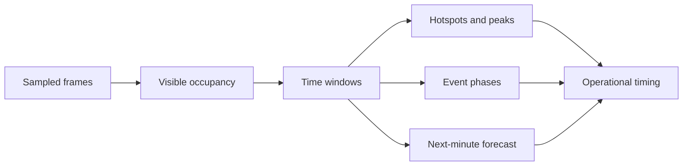

# Video analytics

## Temporal signals

The reports use time as a first-class dimension rather than presenting a single aggregate score. They expose occupancy curves, selectable windows, hotspots, five-minute blocks, event phases and a limited next-minute forecast.

Mandala documents a 7.50-frames-per-second analysis cadence with a constant 0.133-second interval. Its occupancy report supports 30-second, 1-minute, 5-minute and 10-minute windows, making it possible to move from short operational spikes to an executive trend.

The lecture report covers 2h03m21s and separates formation, stable presentation time and closing circulation. Its forecast validation is explicitly limited to a 30-minute test from one lecture.

## Temporal model

## Forecast evidence

In the lecture report, the model error is shown as 1.04 people, compared with 1.41 for a simple “last observed value” reference, a 26% reduction in that test. This supports a narrow claim: the tested model outperformed the reference in that sample. It does not support a general promise of production forecasting quality.

## Why the temporal layer matters

For a physical-space product, a useful recommendation is often time-bound:

- increase staff or demonstrations before a recurring peak;
- protect a corridor during a high-pressure window;
- compare a layout change by event phase rather than by one daily average;
- schedule a new data-collection instrument where measurement quality drops.

<!-- VISUAL SLOT: Temporal analytics. Add a real chart or short screen recording showing occupancy, a hotspot window and the decision it informs. -->

<!-- VISUAL SLOT: Forecast validation. Add a chart with observed, predicted and baseline series plus the sample size and validation window. -->